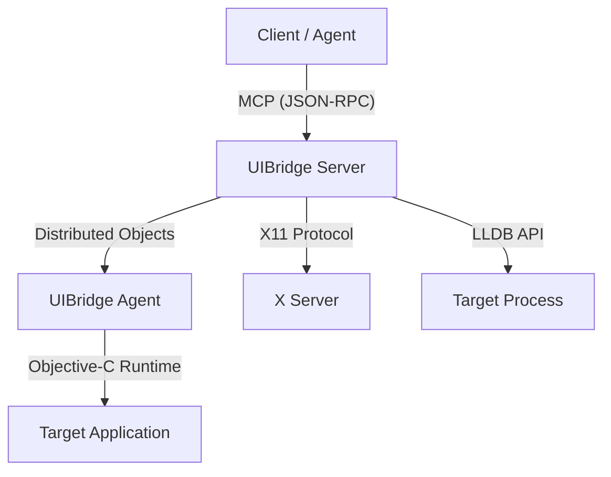

# UIBridge Architecture

UIBridge implements a decoupled architecture that bridges the gap between high-level AI agents and low-level native desktop applications. It leverages the Objective-C runtime's introspection capabilities and the Model Context Protocol (MCP) to provide a programmable interface to GNUstep applications.

## System Overview

The system is composed of an **injected agent** and a **coordinating server**.

## 1. UIBridge Agent

The Agent is a dynamic library (`libUIBridgeAgent.so`) that runs within the target application's process space.

### Injection and Lifecycle
The Agent is injected using the `LD_PRELOAD` environment variable. Upon loading, it checks the `UIBRIDGE_TARGET` environment variable against the current process name. If they match, it initializes:
- **Registration Thread**: A background thread that periodically attempts to register the Agent with the system's `NSConnection` name server.
- **Distributed Objects Interface**: Implements the `UIBridgeProtocol`, allowing the Server to invoke methods across process boundaries.

### Object Registry and Identity
UIBridge uses a **Pointer-as-ID** strategy (`objc:<pointer>`) to uniquely identify Objective-C objects without requiring a complex mapping table.
- **Serialization**: Objects are serialized into JSON descriptors containing their ID, class name, and relevant state (e.g., frame for views, title for windows).
- **Resolution**: The Agent resolves incoming IDs back to live objects using standard pointer casting, relying on the stability of objects within the same process session.

### Main Thread Execution
To ensure thread safety with AppKit, the Agent executes all state-mutating or UI-querying operations on the application's **Main Thread** using `performSelectorOnMainThread:waitUntilDone:`.

## 2. UIBridge Server

The Server acts as the central coordinator and MCP gateway.

### Connection Management
The Server is responsible for:
- **Application Launching**: Setting the necessary environment variables (`LD_PRELOAD`, `UIBRIDGE_TARGET`) and spawning the target process.
- **DO Proxying**: Establishing an `NSConnection` to the injected Agent and managing the proxy object.

### Tool Implementation
The Server exposes a set of **MCP Tools** that abstract the complexity of the Agent's protocol. It handles:
- **Protocol Translation**: Converting JSON-RPC tool calls into Distributed Objects method calls.
- **Error Handling**: Gracefully handling agent disconnects or execution failures.

## 3. Extended Integrations

### X11 Support
The Server communicates directly with the X Server to provide capabilities that AppKit cannot easily provide from within the process:
- **Global Window Discovery**: Listing all top-level X11 windows.
- **Input Simulation**: Generating synthetic mouse and keyboard events at exact screen coordinates.

### LLDB Integration
For deep debugging and crash analysis, the Server can attach LLDB to the target process. This allows for:
- **Memory Inspection**: Reading raw memory or registers.
- **Diagnostic Execution**: Running complex debugger scripts to analyze application state.

## 4. Communication Protocol

The `UIBridgeProtocol` defines the contract between the Server and Agent. It includes methods for:
- **Introspection**: Retrieving root objects and deep object details.
- **Control**: Invoking selectors and triggering menu actions.
- **Serialization**: Ensuring data returned from the Agent is JSON-safe and properly sanitized.
